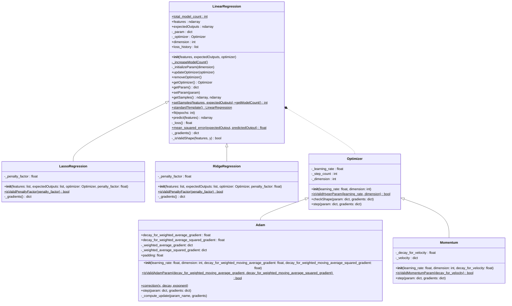

```mermaid
classDiagram
    class LinearRegression {
        +total_model_count : int$
        +features : ndarray
        +expectedOutputs : ndarray
        -_param : dict
        -_optimizer : Optimizer
        +dimension : int
        +loss_history : list
        +__init__(features, expectedOutputs, optimizer)
        -_increaseModelCount()$
        -_initializeParam(dimension)
        +updateOptimizer(optimizer)
        +removeOptimizer()
        +getOptimizer() Optimizer
        +getParam() dict
        +setParam(param)
        +getSamples() ndarray, ndarray
        +setSamples(features, expectedOutputs) +getModelCount()$ int
        +standardTemplate()$ LinearRegression
        +fit(epochs: int)
        +predict(features) ndarray
        -_loss() float
        +mean_squared_error(expectedOutput, predictedOutput)$ float
        -_gradients() dict
        -_isValidShape(features, y) bool
    }

    class LassoRegression {
        -_penalty_factor : float
        +__init__(features: list, expectedOutputs: list, optimizer: Optimizer, penalty_factor: float)
        +isValidPenaltyFactor(penalty_factor)$ bool
        -_gradients() dict
    }

    class RidgeRegression {
        -_penalty_factor : float
        +__init__(features: list, expectedOutputs: list, optimizer: Optimizer, penalty_factor: float)
        +isValidPenaltyFactor(penalty_factor)$ bool
        -_gradients() dict
    }

    class Optimizer {
        -_learning_rate : float
        -_step_count : int
        -_dimension : int
        +__init__(learning_rate: float, dimension: int)
        +isValidHyperParam(learning_rate, dimension)$ bool
        +checkShape(param: dict, gradients: dict)
        +step(param: dict, gradients: dict)
    }

    class Adam {
        +decay_for_weighted_average_gradient : float
        +decay_for_weighted_average_squared_gradient : float
        -_weighted_average_gradient: dict
        -_weighted_average_squared_gradient: dict
        +padding: float
        +__init__(learning_rate: float, dimension: int, decay_for_weighted_moving_average_gradient: float, decay_for_weighted_moving_average_squared_gradient: float)
        +isValidAdamParam(decay_for_weighted_moving_average_gradient, decay_for_weighted_moving_average_squared_gradient)$ bool
        +correction(x, decay, exponent)$
        +step(param: dict, gradients: dict)
        -_compute_update(param_name, gradients)
    }

    class Momentum {
        -_decay_for_velocity : float
        -_velocity : dict
        +__init__(learning_rate: float, dimension: int, decay_for_velocity: float)
        +isValidMomentumParam(decay_for_velocity)$ bool
        +step(param: dict, gradients: dict)
    }

    LinearRegression <|-- LassoRegression
    LinearRegression <|-- RidgeRegression
    Optimizer <|-- Adam
    Optimizer <|-- Momentum
    LinearRegression *.. Optimizer
```
